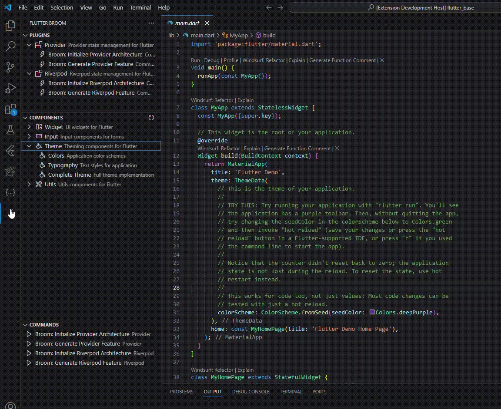

# Flutter Broom

**Flutter Broom** adalah ekstensi Visual Studio Code yang membantu pengembang Flutter menghasilkan struktur proyek terorganisir dengan cepat menggunakan pendekatan Clean Architecture.

## Fitur Utama

- Generate struktur folder otomatis sesuai arsitektur yang direkomendasikan
- Generate file untuk fitur baru (Service, Provider, dan Page)
- Update routes dan providers secara otomatis
- Customizable base path

## Cara Penggunaan

1. **Generate Struktur Proyek:** `Flutter Broom: Generate Project Structure`
2. **Generate Fitur Baru:** `Flutter Broom: Generate New Feature`

## Kebutuhan

- Flutter SDK
- Visual Studio Code
- Node.js

## Konfigurasi

- `flutterBroom.projectRoot`: Jalur root proyek Flutter. Default: `lib`
- `flutterBroom.usePascalCase`: Penggunaan PascalCase untuk penamaan file. Default: `true`

## Versi

- 1.0.0: Rilis awal Flutter Broom
